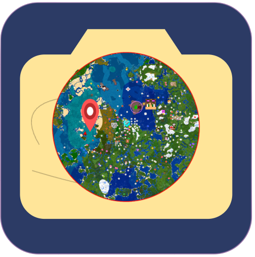
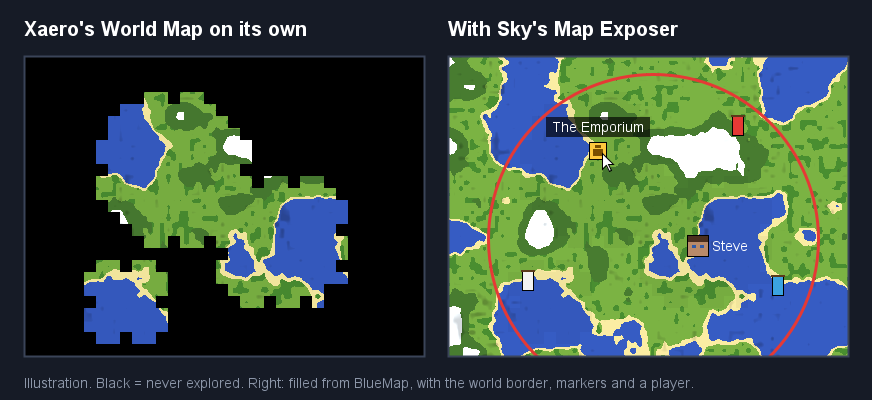
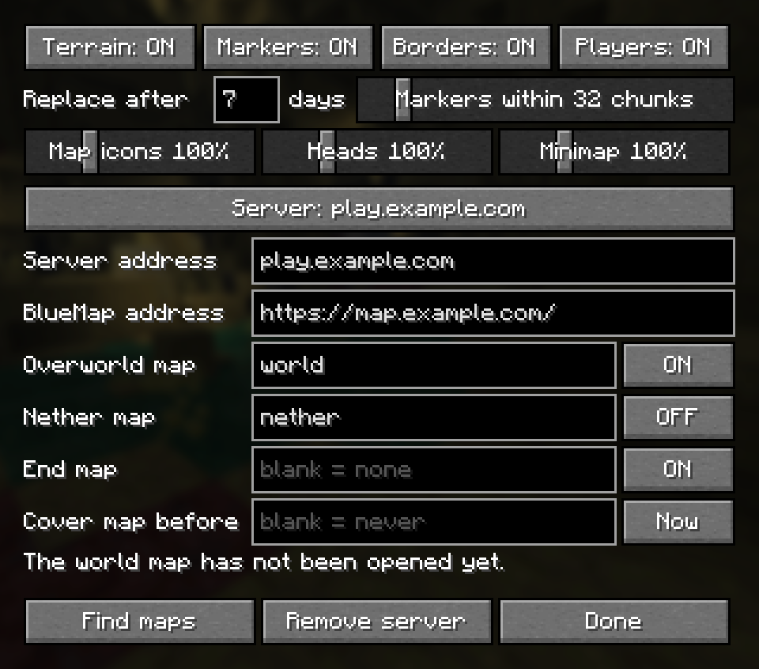
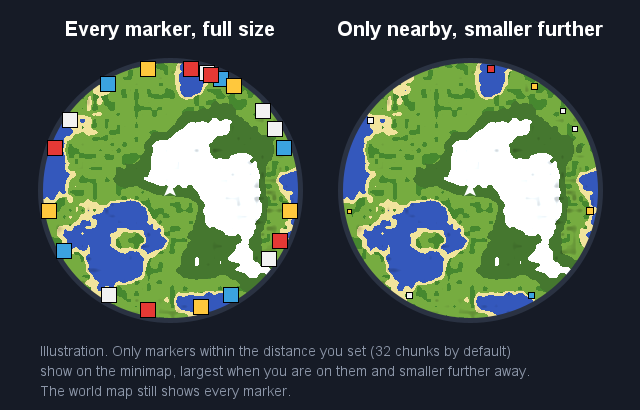

<p align="center"></p>

# Sky's Map Exposer

A client-side Fabric mod for Minecraft 26.2 that brings a server's **BlueMap** into **Xaero's
World Map** and **Xaero's Minimap**.

**[Download the latest version](https://github.com/SkyStormer1/SkysMapExposer/releases/latest)**



## What it does

- **Fills in your map.** Anywhere your map is blank shows BlueMap's terrain instead, including the
  gaps inside areas you explored. So does any part you haven't seen for a while (7 days by
  default) if BlueMap has a newer picture, and anything mapped before a date you choose, for a map
  left over from a previous season.
- **Shows the world border and zones.** BlueMap's outlines are drawn on both maps in their own
  colours, and update when the server changes them.
- **Shows BlueMap's markers.** Shops, banners and the like appear as icons on the world map and
  minimap only, never floating in the world. Hover one for its name. Right-click it on the world
  map and choose **Save as waypoint** to turn it into an ordinary, permanent Xaero waypoint.
- **Shows other players** on the world map of the dimension they are in, with their face.
- **Keeps up live.** Terrain on screen is re-checked every minute, markers every 30 seconds,
  players every 2 seconds.

Your own map is never changed. Remove the mod and Xaero's map is exactly as it was, and wherever
you go, Xaero maps the area again and your own map takes over from BlueMap.

## Installing

You need:

- Minecraft **26.2** with **Fabric Loader** 0.19.3 or newer
- **Fabric API** and **Fabric Language Kotlin**
- **Xaero's World Map** 1.44 or newer
- Recommended: **Xaero's Minimap** (for the minimap and for saving waypoints) and **Mod Menu**
  (for the settings screen)

Download the `.jar` from the [latest release](https://github.com/SkyStormer1/SkysMapExposer/releases/latest)
and put it in your `mods` folder with the others.

## Setting up a server

The mod does nothing until you tell it where a server's BlueMap is. You do this once per server.

1. **Find the server's BlueMap.** It is a website, usually linked from the server's Discord or
   website, and often at the server's address on port 8100. Open it in your browser and copy the
   address from the address bar, for example `https://map.example.com/`.
2. **Join the server**, then open the settings: press Esc, click **Mods**, find
   **Sky's Map Exposer** and click the cog.
3. The screen opens on the server you are on, with **Server address** already filled in.
   Paste the address from step 1 into **BlueMap address**.
4. Press **Find maps**. The line above the buttons lists the maps that BlueMap has, and the
   overworld is filled in for you. Type the right map names into **Nether map** and **End map** if
   you want them. Leave a box blank to not use BlueMap there.
5. Press **Done**. Open the world map (M). Unexplored areas now show BlueMap's terrain.



### The settings

Hover over any setting in the game for an explanation.

| Setting | What it does |
|:--|:--|
| **Terrain / Markers / Borders / Players** | Switch each part on or off, for every server. |
| **Replace after … days** | How old your own map must be before BlueMap's newer picture replaces it. |
| **Markers within … chunks** | How far away BlueMap markers show on the minimap. |
| **Map icons / Heads / Minimap** | How big markers and players' heads are drawn. |
| **Server** | Which server you are editing. Click through to switch, or to add one. |
| **Server address** | Every name you join this server by, separated by commas, e.g. `play.example.com, 203.0.113.7`. |
| **BlueMap address** | The web page of the server's BlueMap. |
| **Overworld / Nether / End map** | Which BlueMap map to use for each dimension. The **ON/OFF** button beside it switches that dimension's *terrain*. Borders, markers and players still show with terrain off. |
| **Cover map before** | Your overworld map from before this date and time (`yyyy-MM-dd HH:mm`) is covered by BlueMap however recent it is. Useful when a new season starts on a new world. **Now** fills in the current time. Leave blank for never. |
| **Find maps** | Asks the BlueMap which maps it has. |
| **Remove server** | Forgets the server shown. |

**The nether:** many servers render their nether BlueMap from above the roof, which looks nothing
like Xaero's nether map. So nether terrain starts **OFF**. Its world border, markers and players
still show. Switch it on if your server's nether map shows the inside.

## Markers on the minimap

The minimap only shows BlueMap markers near you, so a busy server doesn't crowd its edge. The
world map always shows every marker.



## Saving a marker as a waypoint

On the world map, hover over a BlueMap marker to see its name, right-click it, and choose
**Save as waypoint**. It becomes a normal Xaero waypoint in your current waypoint set, with its
name, initials and colour, and stays even if the marker is later removed from BlueMap. Waypoints
are saved to the dimension you are standing in, so the world map must be showing that dimension.

## How "old" is decided

- **Your map:** from the moment the mod is installed, it records when each chunk was last loaded,
  which is when Xaero last redrew it. For areas mapped before that, the date of Xaero's own save
  file for that area is used.
- **BlueMap's map:** BlueMap does not say when it drew each part, so the mod dates each part by
  the first time it saw the current picture.

## Privacy

Everything stays on your computer. The mod only downloads from the BlueMap address you enter, and
sends nothing to the Minecraft server or anywhere else. Its data is kept in `skysmapexposer/` in
your game folder, and its settings in `config/skysmapexposer.json`.

## Limits

- Surface only: in Xaero's cave mode only borders and markers are drawn, not terrain.
- Gaps inside explored areas are found by asking Xaero, which only knows while that area is
  loaded on its map. Once seen, a gap is remembered until you leave the server.
- Typing `/mapexposer` shows a status line if something is not drawing. It stays on your computer
  and is never sent to the server.

## Building

```
./gradlew build
```

The jar is in `build/libs/`. The tests that talk to a real BlueMap only run with `BLUEMAP_URL` set
to one that has a map called `world`.

## Originality

Written from scratch; no code was copied from any other project.

- [MapLink](https://github.com/thebuildcraft/MapLink) (GPL-3.0) does similar things. It was looked
  at only to see what it does, not how.
- BlueMap (MIT) is used only as a website: its tile, marker and player files were checked against
  a live server.
- Xaero's World Map and Minimap are closed source. They are compiled against, never bundled, and
  only their public method, field and local-variable names were read, to place the mixins and use
  their element and waypoint systems.

The pictures of the maps are illustrations drawn for this page; the settings screen is a real
screenshot.

## License

MIT © 2026 SkyStormer1
