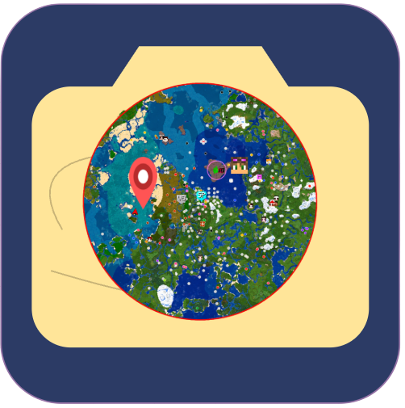
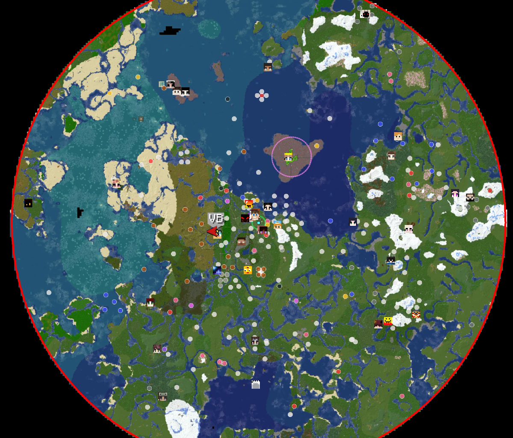
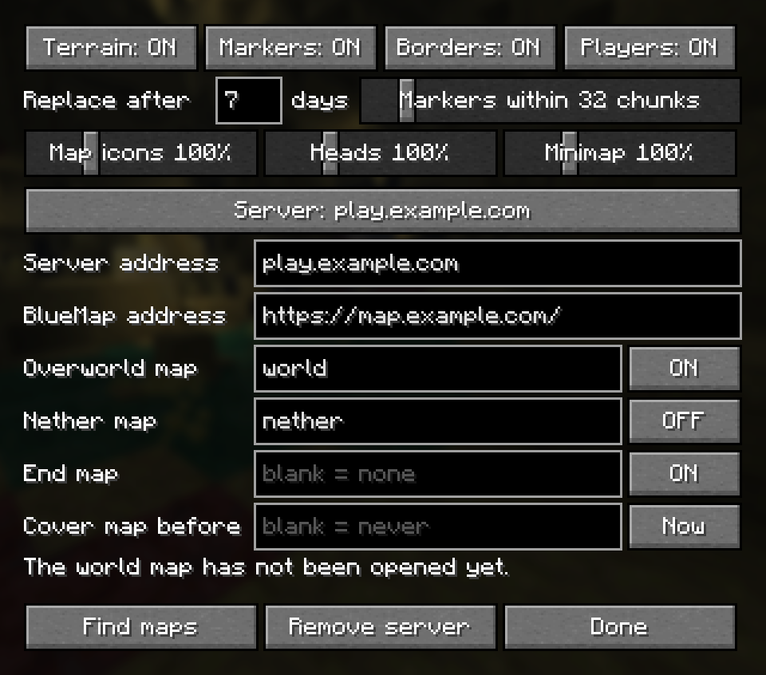
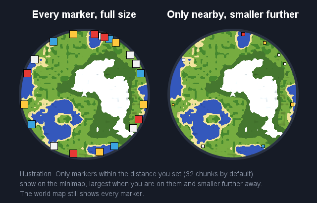

<p align="center"></p>

<h1 align="center">BlueMap Unlocked: Sky's Map Exposer</h1>

<p align="center">
A client-side Fabric mod for Minecraft 26.2 that brings a server's <b>BlueMap</b> into
<b>Xaero's World Map</b>, <b>Xaero's Minimap</b> and more.
</p>

<p align="center">
  <a href="https://github.com/SkyStormer1/SkysMapExposer/releases/latest">
    
  </a>
</p>

<p align="center">
  
  
  <a href="LICENSE"></a>
  <a href="https://github.com/SkyStormer1/SkysMapExposer/releases"></a>
</p>



<sub>An unofficial, fan-made mod. Not made by, endorsed by or affiliated with the BlueMap or Xaero's Minimap / World Map projects.</sub>

## What it does

- **Fills in your map.** Anywhere your map is blank shows BlueMap's terrain instead, including the
  gaps inside areas you explored. So does any part you haven't seen for a while (7 days by
  default) if BlueMap has a newer picture, and anything mapped before a date you choose, for a map
  left over from a previous season. While BlueMap's detailed pictures download, a blurry one
  from BlueMap's coarser tiles stands in, with a small spinner, so nothing waits on a blank map.
- **Finds biomes.** Search for a biome in the bar on the world map and click it: every place your
  map recorded it is tinted in its own colour, on the minimap too if you like. Pick several to
  see them side by side.
- **Shows the world border and zones.** BlueMap's outlines are drawn on both maps in their own
  colours, and update when the server changes them.
- **Shows BlueMap's markers.** Shops, banners and the like appear as icons on the world map and
  minimap only, never floating in the world. Hover one for its name. Right-click it on the world
  map and choose **Save as waypoint** to turn it into an ordinary, permanent Xaero waypoint, or
  **Set temporary waypoint** for one that goes when you leave. With
  [Sky's Map Shapes](https://github.com/SkyStormer1/SkysMapShapes) installed, **Add shape here**
  draws a shape centred on it. The **Markers** switch in the bar on the world map hides or shows them all in one click.
- **Shows other players** on the world map and minimap of the dimension they are in, with their
  face. BlueMap knows where everyone is, so they stay on your minimap after they walk out of your
  render distance and Xaero's own radar loses them.
- **Locks on to a player.** Right-click someone and choose **Lock on**: their pin follows them
  wherever they go, and their head floats over them in the world like a waypoint, until you unlock
  them. The head hides itself the moment you can actually see the player.
- **Lists everyone online.** **List** in the bar on the world map opens a screen with search,
  distance and coordinates, a **Go to** that jumps the map to anyone, and **Lock**.
- **Copies coordinates.** Right-click anywhere on the world map, or any marker or player, and
  choose **Copy coordinates**. The dimension comes with them.
- **Keeps up live.** Terrain on screen is re-checked every minute, markers every 30 seconds,
  players every 2 seconds.
- **Downloads BlueMap into your own map, if you ask it to.** Write BlueMap's terrain into Xaero's
  map for good, so it stays after the mod is removed and shows everywhere Xaero's map does. See
  [Downloading into your own map](#downloading-into-your-own-map).

Until you download, your own map is never changed. Remove the mod and Xaero's map is exactly as it
was, and wherever you go, Xaero maps the area again and your own map takes over from BlueMap.

## Installing

You need:

- Minecraft **26.2** with **Fabric Loader** 0.19.3 or newer
- **Fabric API** and **Fabric Language Kotlin**
- **Xaero's World Map** 1.44 or newer
- Recommended: **Xaero's Minimap** (for the minimap and for saving waypoints) and **Mod Menu**
  (for the settings screen)

Then **[download the latest `.jar`](https://github.com/SkyStormer1/SkysMapExposer/releases/latest)**
and put it in your `mods` folder with the others.

## Setting up a server

The mod does nothing until you tell it where a server's BlueMap is. You do this once per server.

1. **Find the server's BlueMap.** It is a website, usually linked from the server's Discord or
   website, and often at the server's address on port 8100. Open it in your browser and copy the
   address from the address bar, for example `https://map.example.com/`.
2. **Join the server**, then open the settings: press Esc, click **Mods**, find
   **Sky's Map Exposer** and click the cog.
3. The screen opens on the server you are on, with **Server address** already filled in.
   Paste the address from step 1 into **BlueMap address**.
4. Press **Find maps**. The line above the buttons lists the maps that BlueMap has, and the
   overworld is filled in for you. Type the right map names into **Nether map** and **End map** if
   you want them. Leave a box blank to not use BlueMap there.
5. Press **Done**. Open the world map (M). Unexplored areas now show BlueMap's terrain.



### The settings

Hover over any setting in the game for an explanation.

| Setting | What it does |
|:--|:--|
| **Terrain / Markers / Borders / Players** | Switch each part on or off, for every server. |
| **Minimap players** | Which players the minimap shows: none, only the ones out of your render distance (so Xaero's radar handles the rest and nobody is drawn twice), or all of them. |
| **Players…** | Opens the player list. |
| **Replace after … days** | How old your own map must be before BlueMap's newer picture replaces it. |
| **Markers within … chunks** | How far away BlueMap markers show on the minimap. |
| **Map icons / Heads / Minimap** | How big markers and players' heads are drawn. **Heads** covers the world map, the minimap and locked players' heads in the world. |
| **Server** | Which server you are editing. Click through to switch, or to add one. |
| **Server address** | Every name you join this server by, separated by commas, e.g. `play.example.com, 203.0.113.7`. |
| **BlueMap address** | The web page of the server's BlueMap. |
| **Overworld / Nether / End map** | Which BlueMap map to use for each dimension. The **ON/OFF** button beside it switches that dimension's *terrain*. Borders, markers and players still show with terrain off. |
| **Cover map before** | Your overworld map from before this date and time (`yyyy-MM-dd HH:mm`) is covered by BlueMap however recent it is. Useful when a new season starts on a new world. **Now** fills in the current time. Leave blank for never. |
| **Find maps** | Asks the BlueMap which maps it has. |
| **Download…** | Downloads BlueMap into your own map; see below. While a download runs, this button stops it. |
| **Remove server** | Forgets the server shown. |

**The nether:** many servers render their nether BlueMap from above the roof, which looks nothing
like Xaero's nether map. So nether terrain starts **OFF**. Its world border, markers and players
still show. Switch it on if your server's nether map shows the inside.

## The bar on the world map

A small see-through panel on the world map holds the mod's switches and the biome finder.

- **Terrain / Markers / Borders / Players** switch each part on or off, as the settings do.
  **Minimap** (only with Xaero's Minimap) chooses whether picked biomes are tinted there too.
  **List** opens the player list, and **Set** the settings.
- **The biome finder** lists the biomes of the dimension the map is showing. Type to search and
  click a biome to tint it; click again to stop, or **Clear** to stop them all. The tint shows
  wherever Xaero recorded that biome, so it covers the parts of the map Xaero has, not BlueMap's
  terrain.
- **Moving and folding:** drag the title to move the bar, click it to fold the bar down to its
  title.
- **Sizing:** drag the bottom edge for more or fewer lines, the right edge to widen it, and the
  bottom-right corner to make everything bigger (only when you drag right and down together).
  The list scrolls with the mouse wheel, or drag its scroll bar.
- **Docking:** with [Sky's Structure Map](https://github.com/SkyStormer1/SkysStructureMap)
  installed, drag one panel's title up under the other's bottom edge and it docks there: the two
  move as one, share a width and a size, and the lower one comes off again when dragged away.
  Neither mod needs the other.

Nothing is ever pushed off screen, and everything is remembered. `panelMaxScale` in
`config/skysmapexposer.json` sets how big the corner may make it (2 by default).

## Markers on the minimap

The minimap only shows BlueMap markers near you, so a busy server doesn't crowd its edge. The
world map always shows every marker.



## Saving a marker as a waypoint

On the world map, hover over a BlueMap marker to see its name, right-click it, and choose
**Save as waypoint**. It becomes a normal Xaero waypoint in your current waypoint set, with its
name, initials and colour, and stays even if the marker is later removed from BlueMap. Waypoints
are saved to the dimension you are standing in, so the world map must be showing that dimension.

**Set temporary waypoint** puts one of Xaero's own temporary waypoints on the marker instead, the
same as Xaero's "Set Temporary Waypoint": handy for walking to a shop, and gone when you leave.

## Players

Everyone BlueMap can see shows up as their face, on the world map and on the minimap of the
dimension they are in. The minimap keeps them after they leave your render distance, which is the
point: zoomed out, you can watch someone cross the map.

By default the minimap only draws the players your game has *not* loaded, because Xaero's own radar
already draws the near ones and you would otherwise see two heads for the same person. If you have
that radar switched off, set **Minimap players** to **All players**.

### Locking on

Right-click a player on the world map and choose **Lock on**. From then on:

- their pin keeps following them on both maps, and is pinned to the edge of the minimap when they
  are off it, the way a waypoint is;
- their head floats over them in the world, with their name and how far away they are, whenever you
  look their way;
- that head disappears as soon as you can genuinely see the player: loaded, visible and with
  nothing between you. Behind a hill, through a wall, or far out of render distance, it stays.

Locks are remembered per server, so they survive relogging. Right-click them again to unlock, or
use **Unlock all** in the player list.

### The player list

Open it with **List** in the bar on the world map, from the map's
right-click menu, from the **Players…** button in the settings, or with `/mapexposer players`.
Search by name, switch between your dimension and all of them, and for anyone: **Go to** (jumps the
world map to them) and **Lock** / **Unlock**. Locked players sort to the top, then the nearest.

**Go to** works across dimensions: for someone in the Nether while your map is showing the
Overworld, the map switches to the Nether to show them, and switches back to what it was on as soon
as you leave the map.

## Looking at another dimension

Under the coordinates of the block under your mouse, the world map also shows the same spot in the
other dimension: the Overworld's coordinates while you look at the Nether, and the Nether's while
you look at the Overworld. **Other dimension XZ** in the settings switches it off.

The world map can be switched to a dimension you are not standing in. Xaero draws your own arrow,
your own waypoints and the entities around you there anyway, converted into that dimension's
coordinates — which is useful for lining a Nether tunnel up with the Overworld, and confusing the
rest of the time, because none of it is where it appears to be. While the map is showing somewhere
you are not, this mod:

- hides your player arrow and the entity radar, leaving your own dimension's map untouched;
- starts you at 0, 0 rather than eight times further out on chunks nobody has mapped;
- switches on Xaero's own "only display current map waypoints" the first time you join a world, so
  the waypoints change with the dimension. It is only ever turned on, never off — undo it from the
  toggle in the world map's waypoint menu, or set `matchWaypointsToDimension` to `false` in
  `config/skysmapexposer.json` to stop the mod touching it.

## Downloading into your own map

Everything above only draws BlueMap over Xaero's map. A download goes further and writes BlueMap's
terrain into Xaero's own map files, so it becomes part of your map.

**Starting one**, for the dimension the world map is showing:

- **A selection:** on the world map, hold the right mouse button and drag over the chunks you want,
  then choose **Download** from the menu. A single right-click picks the chunk under the mouse.
- **Everything:** the **Download…** button in the settings, then **Unexplored only** (fills in chunks
  you have never mapped and leaves everything you explored as it is) or **Everything** (also
  updates what you mapped wherever BlueMap shows something different).
- Or type `/mapexposer download all`, `/mapexposer download unexplored`, or
  `/mapexposer download cancel`.

You can close the map and keep playing while it runs; its progress shows at the top of the world
map and in the action bar. A whole server takes a few minutes.

**What gets written.** BlueMap publishes a finished picture, but Xaero stores a block, a height and
a biome for every spot and draws the picture itself. So each spot gets the block Xaero draws
closest to BlueMap's colour, BlueMap's height, and water as deep as BlueMap's colour suggests. The
biome is the one your map recorded, or else a guess from the colours around it (right about three
times in four in the overworld; set `guessBiomes` to `false` in `config/skysmapexposer.json` for a
plain placeholder). It looks like BlueMap, but the blocks are stand-ins: hovering a spot on the map
may name a block that is not really there. Where BlueMap has nothing, nothing is written, and
anything of yours that already looks like BlueMap is left exactly as it was.

**Backups.** Each region of your map is copied just before a download first changes it, into
`skysmapexposer/<server>/backups/` in your game folder, one folder per download. To undo:

- `/mapexposer backups` lists them, newest first;
- `/mapexposer restore <name>` puts one back, with the world map showing the same dimension;
- `/mapexposer backup` copies the whole dimension's map at any time, to go back to later.

## Copying coordinates

Right-click anywhere on the world map for **Copy coordinates**, which puts `-350 200 (Overworld)`
on your clipboard. On a marker or a player you get their height too, as `-350 72 200 (Overworld)`.
The numbers come first, the way `/tp` and most chat messages want them, with the dimension after —
the map can be switched between dimensions, so coordinates without it can mean the wrong place.

## How "old" is decided

- **Your map:** from the moment the mod is installed, it records when each chunk was last loaded,
  which is when Xaero last redrew it. For areas mapped before that, the date of Xaero's own save
  file for that area is used.
- **BlueMap's map:** BlueMap does not say when it drew each part, so the mod dates each part by
  the first time it saw the current picture.

## Privacy

Everything stays on your computer. The mod only downloads from the BlueMap address you enter, and
sends nothing to the Minecraft server or anywhere else. Its data is kept in `skysmapexposer/` in
your game folder, and its settings in `config/skysmapexposer.json`.

## Limits

- Surface only: in Xaero's cave mode only borders and markers are drawn, not terrain, and a
  download writes only the surface.
- Biomes are only guessed in the overworld; downloads into the nether and the end use one biome
  each.
- Biome guessing can be inaccurate, mainly in areas that are similar like old birch and birch biomes,
  but as you explore, it will be corrected. At the time of writing, it has a general accuracy of 74%-85%
  off of a blank downloaded map.
- Gaps inside explored areas are found by asking Xaero, which only knows while that area is
  loaded on its map, which it always is around you and when you zoom in. Once seen, a gap is
  remembered, including after you rejoin.
- Typing `/mapexposer` shows a status line if something is not drawing. It stays on your computer
  and is never sent to the server.

## Building

```
./gradlew build
```

The jar is in `build/libs/`. The tests that talk to a real BlueMap only run with `BLUEMAP_URL` set
to one that has a map called `world`.

The biome guide bundled with the mod (`src/main/resources/skysmapexposer/biomes/overworld.bin`) is
made by `BiomeGuideTrainer` from a Xaero map with recorded biomes and the BlueMap tiles over it;
the test's comment says how to run it. It holds colours, heights and biome names only, no places.

## Originality

Written from scratch; no code was copied from any other project.

- [MapLink](https://github.com/thebuildcraft/MapLink) (GPL-3.0) does similar things. It was looked
  at only to see what it does, not how.
- BlueMap (MIT) is used only as a website: its tile, marker and player files were checked against
  a live server.
- Xaero's World Map and Minimap are closed source. They are compiled against, never bundled.
  Their class, method and field names, and the layout of their map files, were read to place the
  mixins, use their element and waypoint systems, and write downloads through Xaero's own map code.
  None of their code was copied.

The pictures of the maps are illustrations drawn for this page; the settings screen is a real
screenshot.

## License

MIT © 2026 SkyStormer1
